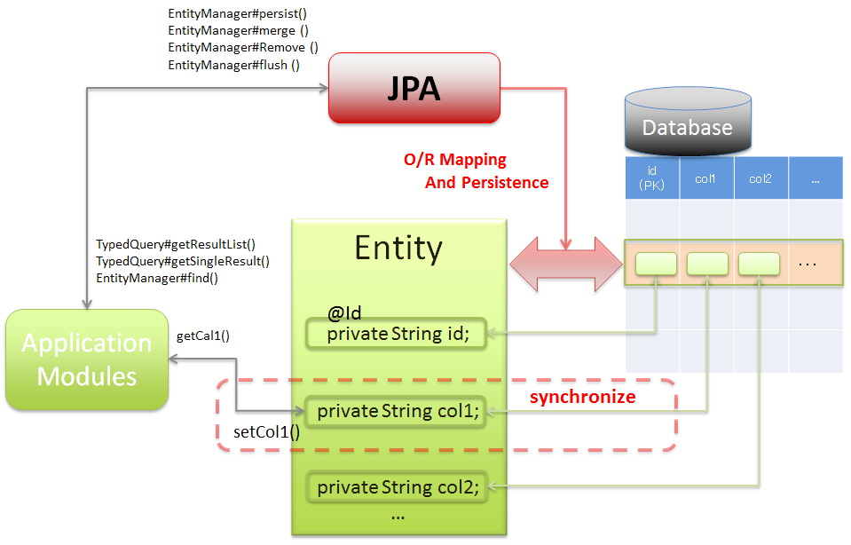

### mysql commnad
- mysql server 起動:  
```$ mysql.server start```
- mysql server 終了:  
```$ mysql.server stop```


### データベース

#### JPA データベースアクセス
- [参考doc1](http://terasolunaorg.github.io/guideline/current/ja/ArchitectureInDetail/DataAccessDetail/DataAccessJpa.html)  
O/R Mapping


#### トランザクション分離レベル
- [参考doc1](https://qiita.com/song_ss/items/38e514b05e9dabae3bdb)

#### ロック
- [楽観ロック/悲観ロック【optimistic locking/pessimistic locking】](https://e-words.jp/w/%E6%A5%BD%E8%A6%B3%E3%83%AD%E3%83%83%E3%82%AF-%E6%82%B2%E8%A6%B3%E3%83%AD%E3%83%83%E3%82%AF.html#:~:text=%E6%A5%BD%E8%A6%B3%E3%83%AD%E3%83%83%E3%82%AF%2F%E6%82%B2%E8%A6%B3%E3%83%AD%E3%83%83%E3%82%AF%E3%80%90optimistic,%E3%81%99%E3%82%8B%E3%81%8B%E3%82%92%E8%A1%A8%E3%81%99%E5%88%86%E9%A1%9E%E3%80%82)

#### 暗黙的なコミット
- [参考doc1](https://gihyo.jp/dev/serial/01/mysql-road-construction-news/0134)


